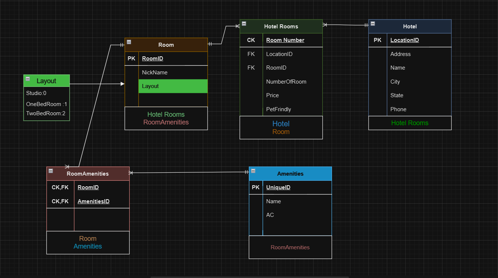

# Async-Inn  Hotel Asset Management System 🏨

Author📝: AlHareth Alhyari.

| Lab  #️⃣     | Class Title   📝           | Date 📅    |
|-----------|----------------------------|------------|
| Lab 11    | Databases and ERDs         | 16/07/2023  |
| Lab 12    | Intro to Entity Framework  | 18/07/2023  |
| Lab 13    | Dependency Injection & Repository Design Pattern  | 24/07/2023  |
| Lab 14    | Navigation props & Routs  | 30/07/2023  |
| Lab 16    | DTOs  | 01/08/2023  |

## Description: 📝

The Async Inn Hotel Asset Management System is a web-based API designed to help Async Inn, a local hotel chain, better manage its hotel assets across multiple locations. This project aims to provide a RESTful API server that allows the management of rooms, amenities, and new hotel locations. The system leverages a relational database to store and maintain the integrity of the data.

---

## ERD Table: 📉

## Official ERD Table: 📉

- This is the table that I relied on the data it contains to design the app.

---

## APIs Images:

[Post](https://github.com/alharet7/Async-Inn/blob/main/Assets/post.png)

[Get](https://github.com/alharet7/Async-Inn/blob/main/Assets/Get.png)

[Put](https://github.com/alharet7/Async-Inn/blob/main/Assets/Put.png)

[Delete](https://github.com/alharet7/Async-Inn/blob/main/Assets/Delete.png)

[New PostRooms Lab14](https://github.com/alharet7/Async-Inn/blob/main/Assets/Lab14post.png)

[New Post amenity ToRooms ByHotel Lab14](https://github.com/alharet7/Async-Inn/blob/main/Assets/Lab14postHotelRoom.png)

[Lab 16](https://github.com/alharet7/Async-Inn/blob/main/Assets/Lab16Done.png)

[Add Amenity To Room In A Hotel Lab 16](https://github.com/alharet7/Async-Inn/blob/main/Assets/Lab16AddAmenityToRoom.png)

---

## Hotel tables:

- **Hotel table** has a location ID which is a primary key which means it is only up for a hotel because we don't have two hotels with the same location ID. and it also had a name,city, state. and each hotel has many rooms and it is connected with rooms table.

- **Room table**: The room table has a room ID which is a primary key, nickname, and layout Enum. and the room has a relationship with two tables it is one to many with Rooms because this room is one room in many rooms in the hotel and many to many with amenities because many rooms can have many of amenities and many amenities, can be assigned for many rooms.

- **Amenities table**: Amenity table has a primary key ID and name attribute and the Amenity table has a relation with room and it is many to many.

- **Hotel Rooms table**: Hotel room is a Joint entity table between two tables it has payload attributes like a price,a pet-friendly and it is many to one with hotel and many to one with Room so in each Hotel we have an unique number of room number and it is composite key between the room ID and hotel location ID

- **Room-Amenities table**: this is a pure join table with Composite-Foreign key the amenity ID and the room ID, so lets explain the data flow here, this each room can have multi amenity but cann't take duplicated amenity you can't find a room with two coffe maker for example, and many amenity can belong to single room.
